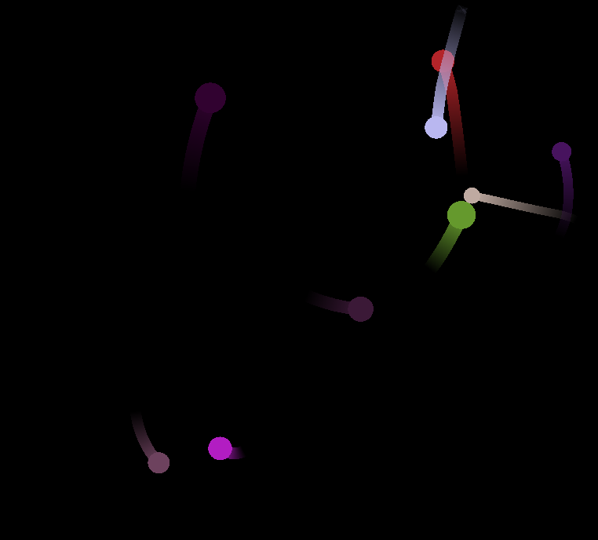

# Gravity-Particles
Gravity Particles Simulation using C++20 and SFML



## Description
This project is a simulation of gravitational particles where each particle has certain mass and they attract others based on newton's laws of gravitation. Like the famous N-body problem.

## How to install
If you are on Windows you can directly go to [Release](https://github.com/RougherO/Double-Pendulum/releases/tag/v1.0.0) section and choose the Windows zip folder extract it and execute the exe file from console. See [How to use](#how-to-use)

It is unfortunate that I do not have enough knowledge to distribute projects in the form of AppImage or Flatpaks for Linux at this point so building from source is recommended to prevent any dependency issue. You can expect the next release to have a Linux AppImage version.

For Linux folks [building the project](#building) is the recommended route for now.
## How to build
### Requirements
1. `C++ version >= 20` :

    Check your compiler version, if it has support for c++20. 
2. `cmake >= 3.21` :

    Check if you have CMake installed by running
    ```bash
    $ cmake --version
    ```
    If it is not available then install CMake from [here](https://cmake.org/download/ "Download CMake here") depending on your OS. Add it to your PATH environment variable.

    If you are on Linux, you can use the one provided by your package managers.
3. `SFML = 2.6.x` :

    The provided CMakeLists.txt by default installs SFML for you using `FetchContent()` in the build directory you provide and links them to the executable. If you already have SFML installed with version 2.6 in standard path then you can disable this behaviour and then build the project.

### Building
1. Create a `build` directory in current project directory and then create a Debug and Release directory under it.

    ```bash
    $ mkdir build
    $ mkdir build/Debug && mkdir build/Release
    ```
Select Debug or Release build:- 

2. * For a Release build:    

    ```bash
    $ cmake -S . -B build/Release
    $ cmake --build build/Release --config Release
    ```
    * For a Debug build:

    ```bash
    $ cmake -S . -B build/Debug
    $ cmake --build build/Release --config Debug
    ```
    This will build for the default builder you have [Makefile or Ninja or MSVS etc]. You could specify a builder by adding a -G flag, for example to create build files for Ninja:
    ```bash
    $ cmake -G "Ninja" -S . -B build/[Debug/Release]
    ```
3. Navigate to `build/Debug` or `build/Release` and run the executable

    ```bash
    $ cd build/[Release/Debug]
    $ ./DoublePendulum (Linux)[./DoublePendulum.exe(Windows)]
    ```
## How to use
Just executing the file should start the project after that clicking randomly in the screen will restart the simulation everytime with the particles spawning in random points with random colors.

_If you like this project be sure to star it_ :)
